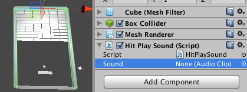
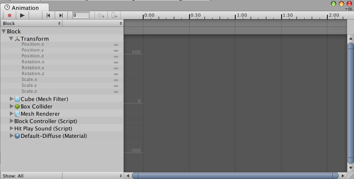
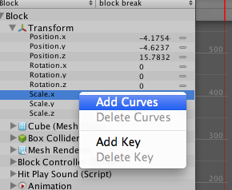
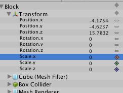
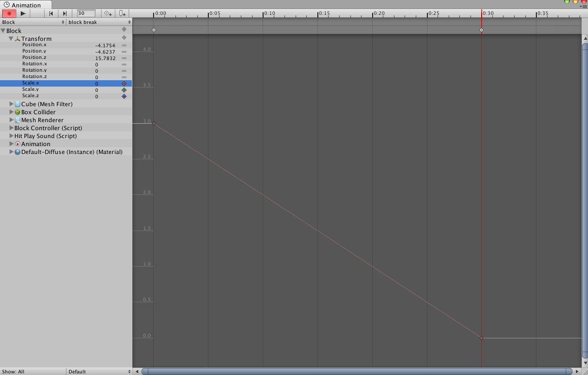
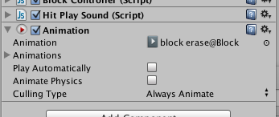
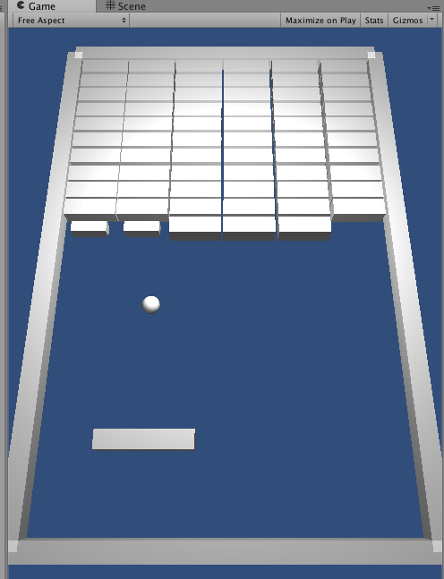
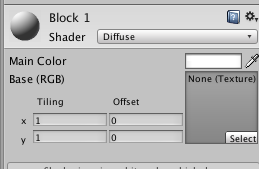
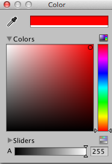

#第三回


前回はゲームのルールを追加し、基本的なゲームの体裁を整えました。
しかし、単純に消えるだけでは華やかさが足りないので、今回はゲームの演出を追加していきます。


##音の追加


今回使用する音をインポートします。
まずこちらのリンクからサウンドファイルを取得します。


次にダウンロードしたアーカイブを展開し、Unityのプロジェクトビューにフォルダごとドラッグ＆ドロップで登録します。

インポートが始まり、プロジェクトビューにSoundフォルダが追加されました。
これでUnityからサウンドを使用出来る形になりました。


###接触時の音に再生するスクリプト


次に、「物が当たった時に音を再生する機能」を作成していきます。
これは前回で「物が命中した際に呼び出す」機能を応用して実装します。


まず、新しいスクリプト「HitPlaySound」を追加します。

次に、下記のコードを追加します。

```
public var sound : AudioClip;


function OnCollisionEnter(collision: Collision) {
     AudioSource.PlayClipAtPoint(sound, );
}
```


少し解説しましょう。まず1行目のAudioClipとは何かというと、音を登録する変数です。
AudioClipに音を登録し、4行目のAudioSource.PlayClipAtPointにて音を再生しています。
なお、音の発生源は第二引数で指定します。今回の場合は、音の発生源に接触した対象の位置を使用します。

では、このスクリプトを「外壁」に登録します。ただし、一つ一つ登録するのは面倒くさいので一括で登録しましょう。
まずShiftを押しながら外壁を選択し、次にインスペクターにHitPlaySoundコンポーネントをドラッグ＆ドロップします。
最後に、プロジェクトビューにある先ほどインポートした音の中から「Touch」をドラッグ＆ドロップし
インスペクターにあるHItPlaySoundのsoundに登録します。





早速実行してみて下さい。
壁にボールが当たった際に音が再生されましたか？


上手くいったならば、同様に壊れるブロックとラケットにも音を追加していきましょう。

まずヒエラルキービューのBlockを[Shit]を押しながら一気に選択します。
次にHitPlaySoundをインスペクタビューにドラッグ＆ドロップして登録します。最後にサウンド「Damage」をインスペクターのSoundにドラッグ＆ドロップで登録します。

同様に、RacketにHitPlaySoundを登録します。再生するサウンドはTouchを登録しておきましょう。
ついでに一番下の壁（BottomWall）にHitPlaySoundを登録し、サウンド「Death」を登録します。

実際にプレイしてみましょう。
サウンドが気に入りませんか？　色々と登録して試してみて下さい。

最後にBGMを追加しましょう。
ヒエラルキーのMain Cameraを選択し、プロジェクトビューのサウンド「BGM」をインスペクターにドラッグ&ドロップします。


早速プレイしましょう。
音楽が変わるだけでグっとゲームらしくなりますね。

##ブロック消滅の演出の作成

次はブロックが消滅する際の演出を追加してみましょう。

まずはブロックが消滅する際のアニメーションを作りましょう。
[Window][Animation]を選択し、アニメーションビューを表示します。

次にアニメーションを行うオブジェクトを選択します。今回の場合は、ヒエラルキービューの中ので一番上に表示されているブロックを選択します。




こちらの画面を簡単に説明しておくと、画面左の一覧はオブジェクトに登録しているスクリプトやマテリアルの一覧、
画面右の縦目盛りは値の幅、横の目盛りは時間です。


さて、アニメーションを作成して行きましょう！

左上の赤丸ボタンを押し、アニメーションファイルを作成します。
アニメーションファイルの名前は「block erase@Block」としておきます。

その後、Scale.xの辺りを右クリックでメニューを開き、Add Curvesを選択します。




次にアニメーションビュー上部の目盛りを選択し、赤い縦線の位置を0.3（0.5秒）に移動します。
そして、Scale.xとScale.y、Scale.zの値を0に変更します。





最終的には下のような図になるはずです。
では、赤丸の隣の再生ボタンを押して、アニメーションを再生してみましょう。




上手く出来ましたか？
では、このアニメーションを全てのブロックに登録しましょう。
やり方は今までと同じ、消滅するブロックを全て選択しインスペクタービューへドラッグ＆ドロップで登録しましょう。
なお、このまま実行するとゲーム開始と同時にアニメーションが開始してしまうので、何かトリガーが無い限り実行しないようにしましょう。

AnimationのPlay Automaticalyのチェックを外して下さい。




###アニメーション処理の追加と消滅タイミングの調整

次はアニメーションの再生を調整しましょう。

BlockControllerスクリプトを開き、OnCollisionEnterメソッドを下記のように修正します。

```
function OnCollisionEnter(collision: Collision) {
     Destroy(gameObject,0.5);
     collider.enabled = false;
     animation.Play("block erase@Block");
}
```


解説しましょう。
まず2行目、Destroyメソッドは第二引数を設定することで、消滅時間を操作することができます。
この項目でアニメーションが終了する0.5秒まで消滅を待機します。
次に3行目、これはcollider、つまり当たり判定をOFFにします。これで万が一ボールが消滅中のブロックに接触した際に
二重に消滅処理が走るのを防ぎます。
最後に4行目ですが、このPlayの引数でアニメーション名を指定し、特定のアニメーションを再生します。今回の場合はアニメーションが「block erase@Block」なので、
このように記述します。


早速実行してみましょう。
ボールに接触したオブジェクトが小さくなり、最終的には消える感じのゲームになりました。





##色をつけてカラフルに


最後は色を付けましょう。


まずProjectビューを右クリックで開き[Create][Material]を選択します。
マテリアルの名前は「BlockMaterial 1」としておきましょう。


次に、上のほうの消せるブロックを選択し、先ほど作成した「BlockMaterial 1」をインスペクタにドラッグ＆ドロップで登録します。


その後プロジェクトビューの「BlockMaterial 1」マテリアルを選択し、Main Colorを赤く変更します。




赤く変更するにはMain Colorの右側の白い部分を選択し、表示されたカラーパレットの赤い部分を選択します。



画面上部のブロックが赤くなりましたか？


では同様の手順でブロックに色を付けて行きましょう。

「BlockMaterial 2」〜「BlockMaterial 6」を作成し、それぞれの段のブロックに登録。
後はマテリアルの色を階段上になるように調整していきます。


次回はいよいよAndroidに書き出します。
